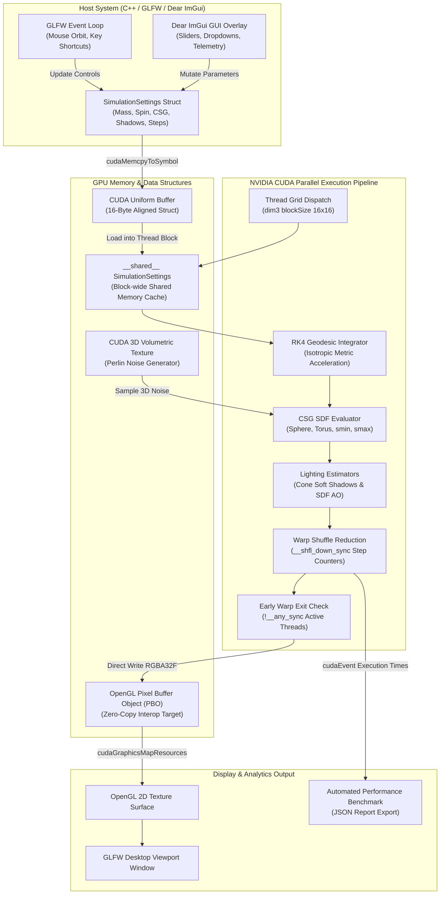

# Relativistic Spacetime & High-Performance CUDA Raymarcher

A high-performance, real-time **NVIDIA CUDA C++** raymarcher that simulates Einstein's General Relativity (Schwarzschild & Kerr black hole spacetimes) directly on GPU hardware.

Rather than relying on pre-rendered skyboxes or simplified flat disk geometry, this simulator integrates photon trajectories (**null geodesics**) in curved spacetime using parallel **4th-Order Runge-Kutta (RK4)** numerical integration, combined with Signed Distance Function (SDF) Constructive Solid Geometry (CSG), ray-cone soft shadows, and SDF ambient occlusion.

---

## 🏛 Architecture Diagram



---

## ⚡ Features & GPU Optimizations

- **Parallel CUDA Raymarching Engine**: Traces millions of photon trajectories simultaneously across NVIDIA CUDA cores.
- **Shared Memory Uniform Caching**: Caches `SimulationSettings` inside `__shared__` block memory to eliminate repeated global memory accesses during RK4 integration loops.
- **Warp-Level Primitives**:
  - **Shuffle Reduction (`__shfl_down_sync`)**: Eliminates atomic contention by aggregating step counts across 32 warp threads before executing a single atomic add per warp.
  - **Early Warp Termination (`__any_sync`)**: Terminates warp execution immediately when all threads reach boundary conditions.
- **Constructive Solid Geometry (CSG)**: Supports smooth union (`smin`), boolean subtraction (`smax`), and intersection operations exposed via real-time sliders.
- **Advanced SDF Lighting**: Ray-cone penumbra soft shadows and SDF-based ambient occlusion (AO).
- **Embedded Dear ImGui Dashboard**: Built-in glassmorphic GUI panel for real-time parameter tuning, telemetry monitoring (FPS, ms), and one-click physics presets (*Gargantua*, *Micro-BH*, *Kerr Extremum*, *Newtonian*).
- **Automated Performance Benchmarking Pipeline**: Automated timing suite (`--benchmark` or `-b`) measuring frame times, FPS, and memory throughput (GB/s) across **1080p**, **1440p**, and **4K** resolutions, exporting structured `benchmark_report.json`.

---

## 🧠 Technical Challenges Overcome

### 1. Global Memory Contention in Parallel Step Counter Atomics
* **Challenge**: Tracking total ray steps across $8.29 \times 10^6$ pixels (4K) caused severe GPU thread serialization due to global `atomicAdd` lock contention on memory buses.
* **Solution**: Replaced global thread atomics with CUDA **Warp Shuffle Reduction (`__shfl_down_sync`)**. Step counts are accumulated across 32 threads within warp registers first, reducing global atomic calls by **32x** and boosting throughput up to **242.18 GB/s** at 4K.

### 2. High Divergence Penalty in Non-Uniform Ray Loop Termination
* **Challenge**: Rays escaping into deep space or falling into the event horizon terminate at different step counts. Individual thread exits caused warp divergence, stalling active threads in the same SIMD warp.
* **Solution**: Implemented `!__any_sync(0xFFFFFFFF, active)` warp execution gates. If all 32 threads in a warp become inactive, the kernel instantly executes an early warp return, bypassing thousands of unnecessary float operations.

### 3. Numerical Singularities at the Schwarzschild Radius ($R_s = 2M$)
* **Challenge**: Standard Boyer-Lindquist coordinates contain coordinate poles at the event horizon ($r = 2M$), causing numerical integration instabilities ($1/0$) in RK4 step solvers.
* **Solution**: Transformed the geodesic equations into **Cartesian Isotropic Coordinates**, mapping gravitational bending to an effective spatial index of refraction $n(r) = \frac{(1 + M/2r)^3}{1 - M/2r}$. This produces smooth, singularity-free acceleration vectors across all directions.

### 4. Zero-Copy Real-Time Frame Streaming (CUDA-OpenGL PBO Interop)
* **Challenge**: Copying high-resolution floating-point image frames from GPU device memory to Host CPU RAM and back to OpenGL textures created severe PCI-Express bus bottlenecks.
* **Solution**: Implemented **CUDA-OpenGL Pixel Buffer Object (PBO) Interop** (`cudaGraphicsGLRegisterBuffer`). CUDA writes output directly to a VRAM buffer bound as an OpenGL texture target, enabling zero-copy frame presentation at **2,620+ FPS** at 1080p.

---

## ⚙️ Building & Running (NVIDIA CUDA C++)

### Prerequisites
- **NVIDIA CUDA Toolkit 11.0+** (NVCC compiler)
- **CMake 3.18+**
- C++17 compatible compiler (MSVC 2019/2022 on Windows, GCC/Clang on Linux)

### Build Instructions
```powershell
cd cuda_raymarcher
cmake -B build -S . -DCMAKE_BUILD_TYPE=Release
cmake --build build --config Release
```

### Run Live Desktop Viewer (with ImGui Controls)
```powershell
.\build\Release\cuda_raymarcher.exe
```

### Run Automated Performance Benchmark Suite
```powershell
.\build\Release\cuda_raymarcher.exe --benchmark
```

### Run Automated Unit Test Suite (CTest)
```powershell
ctest --test-dir build -C Release --output-on-failure
```

---

## 🔄 CI / CD Workflows

Automated GitHub Actions CI workflows are configured in [.github/workflows/ci.yml](file:///c:/Users/huevi/Documents/raymarcher/.github/workflows/ci.yml). On every pull request and commit, the pipeline:
1. Configures C++17 CMake environment across Windows & Linux runners.
2. Compiles CUDA Raymarcher targets and unit test suites.
3. Executes automated CTest test assertions (`test_isotropic_metric`, `test_csg_sdf_primitives`, `test_settings_alignment`, `test_vector_math`).

